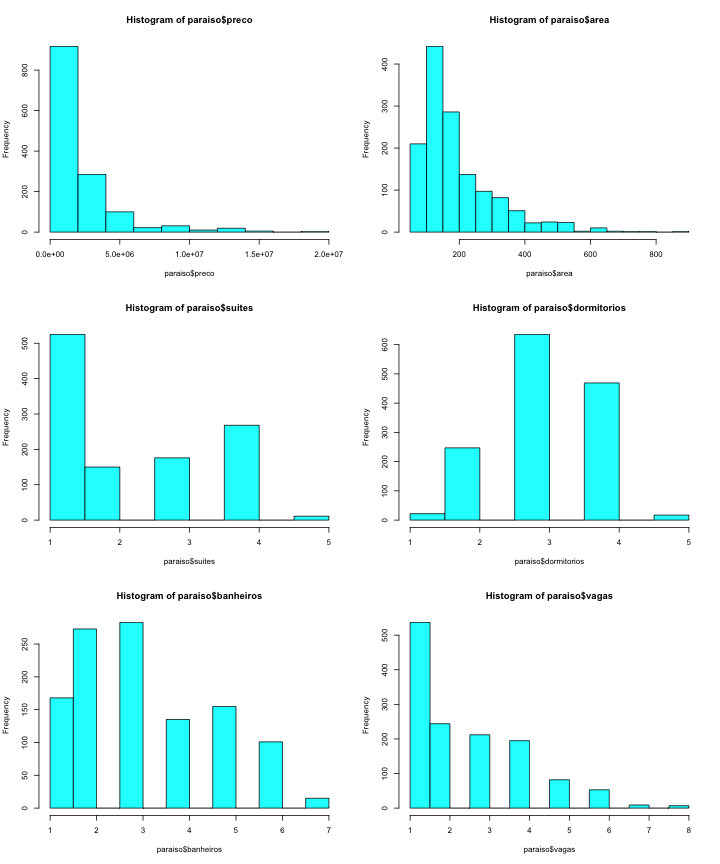
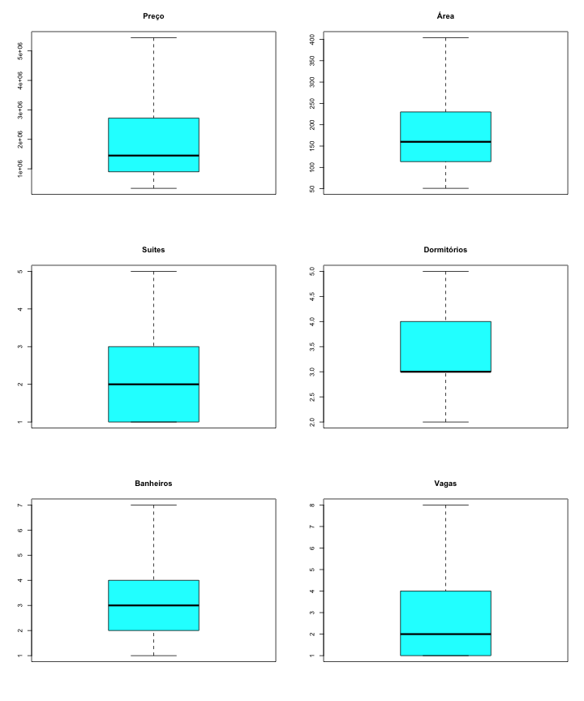
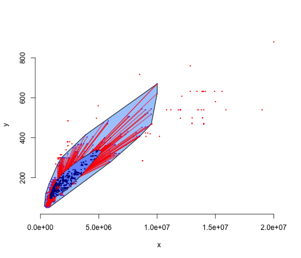
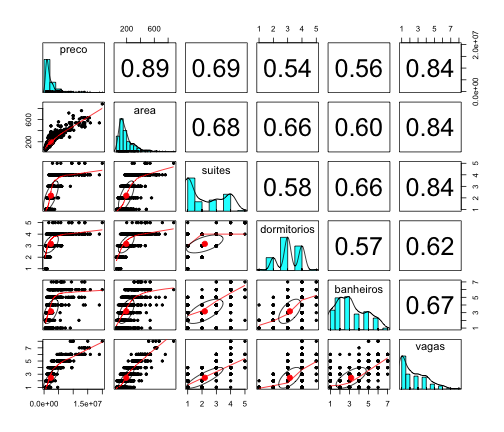
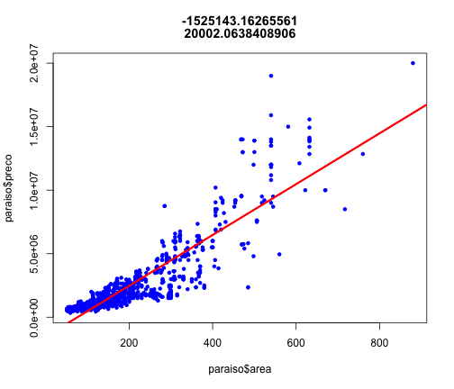
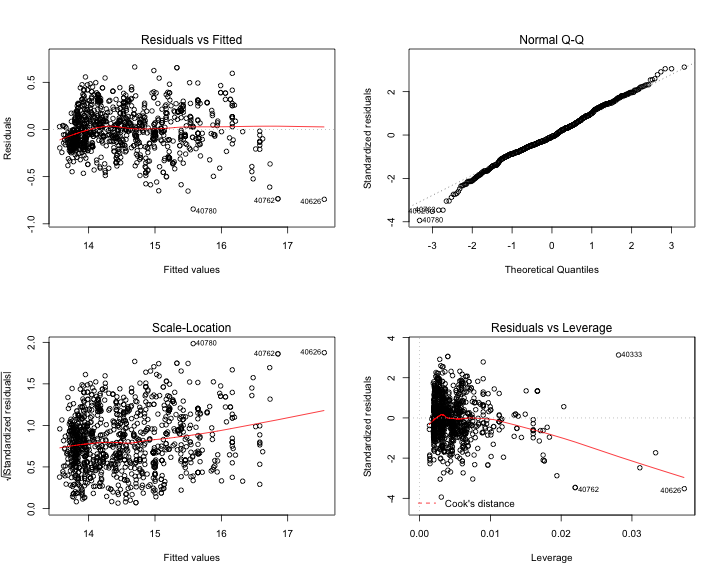

Apartamentos de interesse
========================================================

O objetivo deste relatório é apresentar um modelo preditivo para preços de imóveis no bairro do Paraiso, cidade de São Paulo. Dados utilizados são de **08 de maio de 2016**.


```r
load("../data/paraiso.Rda")
paraiso$bairro <- NULL
paraiso <- paraiso[paraiso$area > 50, ]
summary(paraiso)
```

```
##      preco               area         suites      dormitorios  
##  Min.   :  339000   Min.   : 51   Min.   :1.00   Min.   :1.00  
##  1st Qu.:  900000   1st Qu.:114   1st Qu.:1.00   1st Qu.:3.00  
##  Median : 1450000   Median :160   Median :2.00   Median :3.00  
##  Mean   : 2358306   Mean   :194   Mean   :2.19   Mean   :3.15  
##  3rd Qu.: 2720000   3rd Qu.:230   3rd Qu.:3.00   3rd Qu.:4.00  
##  Max.   :20000000   Max.   :880   Max.   :5.00   Max.   :5.00  
##                                   NA's   :261    NA's   :1     
##    banheiros     descricao             vagas     
##  Min.   :1.00   Length:1391        Min.   :1.00  
##  1st Qu.:2.00   Class :character   1st Qu.:1.00  
##  Median :3.00   Mode  :character   Median :2.00  
##  Mean   :3.18                      Mean   :2.46  
##  3rd Qu.:4.00                      3rd Qu.:4.00  
##  Max.   :7.00                      Max.   :8.00  
##  NA's   :261                       NA's   :52
```

```r
dim(paraiso)
```

```
## [1] 1391    7
```


```r
par(mfrow = c(3, 2))
hist(paraiso$preco, col = "cyan")
hist(paraiso$area, col = "cyan")
hist(paraiso$suites, col = "cyan")
hist(paraiso$dormitorios, col = "cyan")
hist(paraiso$banheiros, col = "cyan")
hist(paraiso$vagas, col = "cyan")
```

 

```r
par(mfrow = c(1, 1))
```


```r
par(mfrow = c(3, 2))
boxplot(paraiso$preco, col = "cyan", main = "Preço", outline = FALSE)
boxplot(paraiso$area, col = "cyan", main = "Área", outline = FALSE)
boxplot(paraiso$suites, col = "cyan", main = "Suites", outline = FALSE)
boxplot(paraiso$dormitorios, col = "cyan", main = "Dormitórios", outline = FALSE)
boxplot(paraiso$banheiros, col = "cyan", main = "Banheiros", outline = FALSE)
boxplot(paraiso$vagas, col = "cyan", main = "Vagas", outline = FALSE)
```

 

```r
par(mfrow = c(1, 1))
```


```r
library(aplpack)
```

```
## Loading required package: tcltk
```

```r
bagplot(paraiso$preco, paraiso$area)
```

 


```r
library(psych)
pairs.panels(paraiso[, c("preco", "area", "suites", "dormitorios", "banheiros", 
    "vagas")])
```

 


```r
m <- lm(preco ~ area, data = paraiso)
plot(paraiso$preco ~ paraiso$area, pch = 20, col = "blue", main = paste(m$coefficients))
abline(m, col = "red", lwd = 3)
```

 


```r
model_1 <- lm(log(preco) ~ area + suites + dormitorios + banheiros + vagas, 
    data = paraiso)
model_2 <- lm(log(preco) ~ area + suites + vagas, data = paraiso)
model_3 <- lm(log(preco) ~ area + suites + vagas + dormitorios, data = paraiso)
```


```r
summary(model_1)
```

```
## 
## Call:
## lm(formula = log(preco) ~ area + suites + dormitorios + banheiros + 
##     vagas, data = paraiso)
## 
## Residuals:
##     Min      1Q  Median      3Q     Max 
## -0.8576 -0.1308 -0.0118  0.1396  0.6714 
## 
## Coefficients:
##             Estimate Std. Error t value Pr(>|t|)    
## (Intercept) 1.31e+01   3.73e-02  352.09   <2e-16 ***
## area        2.66e-03   1.17e-04   22.67   <2e-16 ***
## suites      1.13e-01   1.11e-02   10.18   <2e-16 ***
## dormitorios 1.70e-02   1.37e-02    1.24     0.22    
## banheiros   6.95e-03   6.22e-03    1.12     0.26    
## vagas       1.78e-01   1.08e-02   16.50   <2e-16 ***
## ---
## Signif. codes:  0 '***' 0.001 '**' 0.01 '*' 0.05 '.' 0.1 ' ' 1
## 
## Residual standard error: 0.213 on 891 degrees of freedom
##   (494 observations deleted due to missingness)
## Multiple R-squared:  0.908,	Adjusted R-squared:  0.907 
## F-statistic: 1.75e+03 on 5 and 891 DF,  p-value: <2e-16
```

```r
summary(model_2)
```

```
## 
## Call:
## lm(formula = log(preco) ~ area + suites + vagas, data = paraiso)
## 
## Residuals:
##     Min      1Q  Median      3Q     Max 
## -0.8446 -0.1339 -0.0169  0.1354  0.6627 
## 
## Coefficients:
##             Estimate Std. Error t value Pr(>|t|)    
## (Intercept) 1.32e+01   1.42e-02   926.0   <2e-16 ***
## area        2.67e-03   9.88e-05    27.0   <2e-16 ***
## suites      1.30e-01   9.35e-03    13.9   <2e-16 ***
## vagas       1.75e-01   9.82e-03    17.8   <2e-16 ***
## ---
## Signif. codes:  0 '***' 0.001 '**' 0.01 '*' 0.05 '.' 0.1 ' ' 1
## 
## Residual standard error: 0.215 on 1110 degrees of freedom
##   (277 observations deleted due to missingness)
## Multiple R-squared:  0.913,	Adjusted R-squared:  0.913 
## F-statistic: 3.88e+03 on 3 and 1110 DF,  p-value: <2e-16
```

```r
summary(model_3)
```

```
## 
## Call:
## lm(formula = log(preco) ~ area + suites + vagas + dormitorios, 
##     data = paraiso)
## 
## Residuals:
##     Min      1Q  Median      3Q     Max 
## -0.8437 -0.1328 -0.0167  0.1353  0.6626 
## 
## Coefficients:
##             Estimate Std. Error t value Pr(>|t|)    
## (Intercept) 1.31e+01   3.41e-02  383.42   <2e-16 ***
## area        2.59e-03   1.03e-04   25.00   <2e-16 ***
## suites      1.24e-01   9.62e-03   12.86   <2e-16 ***
## vagas       1.76e-01   9.80e-03   17.93   <2e-16 ***
## dormitorios 3.21e-02   1.25e-02    2.57     0.01 *  
## ---
## Signif. codes:  0 '***' 0.001 '**' 0.01 '*' 0.05 '.' 0.1 ' ' 1
## 
## Residual standard error: 0.215 on 1109 degrees of freedom
##   (277 observations deleted due to missingness)
## Multiple R-squared:  0.914,	Adjusted R-squared:  0.913 
## F-statistic: 2.93e+03 on 4 and 1109 DF,  p-value: <2e-16
```


```r
par(mfrow = c(2, 2))
plot(model_3)
```

 


Aplicando o modelo em novos apartamentos
----------------------------------------


```r
novos_apartamentos <- read.csv("../data/novos_apartamentos.csv", sep = ";")
novos_apartamentos
```

```
##     preco area suites dormitorios vagas
## 1 1350000  180      2           4     2
## 2 1450000  154      1           3     2
## 3 1600000  180      2           3     2
## 4 1750000  200      3           4     3
## 5       1   89      1           3     1
```

```r
exp(predict(model_3, novos_apartamentos))
```

```
##       1       2       3       4       5 
## 1596854 1277610 1546452 2268776  905849
```


