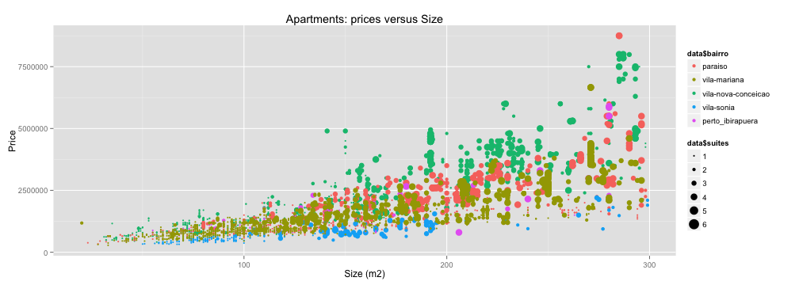
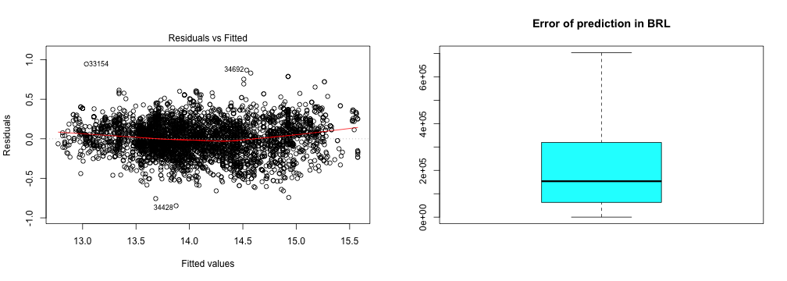

## Introduction and motivation

1. The price of residential real estate in Sao Paulo city has grown very fast in recent years, especially in some neighborhoods.
2. To understand these prices, I accessed some data from estate agencies and 
built a regression model to predict the real estate price, using attributes like: neighborhood name, size, bedrooms, bedrooms with bathrooms and carspaces quantity.


```
##                    bairro area suites dormitorios   preco
## 34130 vila-nova-conceicao   32      1           1  490000
## 34132 vila-nova-conceicao  192      4           4 4675000
## 34133 vila-nova-conceicao  140      2           2 2850000
## 34134 vila-nova-conceicao  157      2           2 3180000
## 34136 vila-nova-conceicao  205      2           3 1900000
```

--- .class #id 

## Crawling data

1. I used a python script to crawler the data. You can find this script [here](https://github.com/fbarth/predictRealEstatePrice/blob/master/data/crawler.py).

2. In September 17,2014 I crawled _104560_ apartment records. I selected only apartments from specific neighborhoods and with size less than 300 square meters. The final dataset has _4701_ examples.

 


--- .class #id 

## Building the model

1. I built a regression model for price (preço) using neighborhood name (bairro), size (area), bedrooms (dormitórios), bedrooms with bathrooms (suítes) and carspaces quantity (vagas). The formula was: lm(log(preco) ~ bairro + log(area) + dormitorios + suites + vagas, data=data). The coefficients are:


```
##               (Intercept)        bairrovila-mariana 
##                  10.75519                  -0.12264 
## bairrovila-nova-conceicao          bairrovila-sonia 
##                   0.29435                  -0.58783 
##    bairroperto_ibirapuera                 log(area) 
##                  -0.06808                   0.60930 
##               dormitorios                    suites 
##                  -0.04829                   0.08100 
##                     vagas 
##                   0.18675
```


--- .class #id 

## Evaluating the model

1. The Adjusted R-squared is 0.8822.

 


--- .class #id 

## Application and references

1. The model developed here works well. But, it can be improved using information about the age of apartment, if the building has (or not) recreation area, swimming pool, etc.
2. The model built in this work was deployed as an application. The URL of this application is [https://fbarth.shinyapps.io/predict_real_estate_price/](https://fbarth.shinyapps.io/predict_real_estate_price/)
3. All the code of this project can be accessed on [https://github.com/fbarth/predictRealEstatePrice](https://github.com/fbarth/predictRealEstatePrice).


