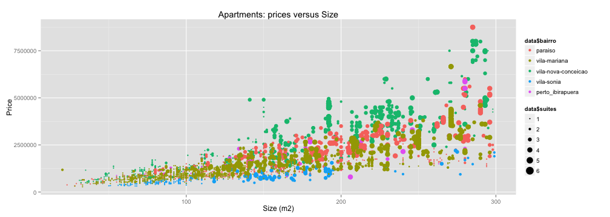

## Introduction and motivation

1. The price of residential real estate in Sao Paulo city has grown very fast in recent years, especially in some neighborhoods.
3. *To understand the prices*, I crawled some data from real estate agencies sities and 
built a regression model using attributes (i.e., neighborhood name, size, bedrooms,
bedrooms with bathrooms and carspaces quantity) to predict the price.


```
##                    bairro area suites dormitorios   preco
## 34130 vila-nova-conceicao   32      1           1  490000
## 34132 vila-nova-conceicao  192      4           4 4675000
## 34133 vila-nova-conceicao  140      2           2 2850000
## 34134 vila-nova-conceicao  157      2           2 3180000
## 34136 vila-nova-conceicao  205      2           3 1900000
```

--- .class #id 

## Crawling data

1. I used a python script to crawler the data. You can find this script [here](https://github.com/fbarth/predictRealEstatePrice/blob/master/data/crawler.py).

2. In September 17,2014 I crawled _104560_ apartment records. I filtered the data selecting only apartments from certain 
neighborhoods and with size less than 300 square meters. The final dataset has _4701_ examples.

 


--- .class #id 

## Building the model

1. I built a regression model for price (preço) using neighborhood name (bairro), size (area), bedrooms (dormitórios), bedrooms with bathrooms (suítes) and carspaces quantity (vagas). The formula was: lm(log(preco) ~ bairro + log(area) + dormitorios + suites + vagas, data=data). The coefficients are:


```
##               (Intercept)        bairrovila-mariana 
##                  10.75519                  -0.12264 
## bairrovila-nova-conceicao          bairrovila-sonia 
##                   0.29435                  -0.58783 
##    bairroperto_ibirapuera                 log(area) 
##                  -0.06808                   0.60930 
##               dormitorios                    suites 
##                  -0.04829                   0.08100 
##                     vagas 
##                   0.18675
```


--- .class #id 

## Evaluating the model

1. The Adjusted R-squared is 0.8822.

 


--- .class #id 

## Application and references

1. The model developed here works well. But, it can be improved using information about the age of apartment, if the building has (or not) recreation are, swimming pool, etc.
3. The model built in this work was deployed as an application. The URL of this application is [https://fbarth.shinyapps.io/predict_real_estate_price/](https://fbarth.shinyapps.io/predict_real_estate_price/)
